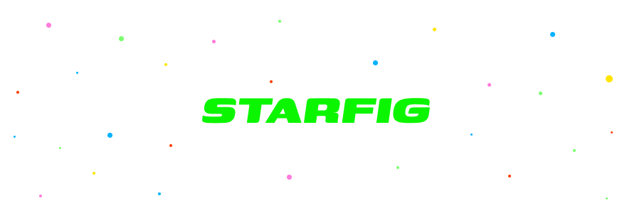

 


Starfig is a programmatic configuration (config) generator. It helps create static configs using [Starlark](https://github.com/bazelbuild/starlark), a deterministic Python-like language.

__Features__

* 👍 __Guranteed correctness.__ Catch invalid config updates by building and testing the source in CI.
* ♻️ __Code reuse.__ Create shared schemas and configs.
* 🚨 __Validation next door.__ Validations live with the schema definitions, written in the same language.
* 🤠 __Good ol' Python.__ Sort of. Starfig uses [Starlark](https://github.com/bazelbuild/starlark), a Python-like language created by Google.
* 💥 __Transpile to your language.__ Generate static configs into multiple languages. Coming soon.

## Table of Contents

<!-- Automatically update this by running `fx tool/toc` -->
<!--ts-->
   * [Table of Contents](#table-of-contents)
   * [Intro](#intro)
      * [Installation](#installation)
      * [What is it?](#what-is-it)
      * [Use Cases](#use-cases)
   * [Getting Started](#getting-started)
      * [Creating a Universe](#creating-a-universe)
      * [Creating a Schema](#creating-a-schema)
      * [Instantiating the schema](#instantiating-the-schema)
      * [Generating the Configs](#generating-the-configs)
      * [Validations](#validations)
      * [Sharing Configs](#sharing-configs)
   * [API](#api)
      * [Files](#files)
         * [STARVERSE](#starverse)
         * [.star File](#star-file)
         * [STARFIG File](#starfig-file)
      * [Target](#target)
      * [load](#load)
      * [Schema](#schema)
      * [Validations](#validations-1)
      * [Primitives](#primitives)
         * [Bool](#bool)
         * [Float](#float)
         * [Int](#int)
         * [String](#string)
         * [Object](#object)
         * [List](#list)
   * [CLI](#cli)
   * [Development](#development)
<!--te-->

## Intro

### Installation

* macOS
    * `brew install starfig`
* Go
    * `go install github.com/jathu/starfig@latest`
* Linux
    * [github.com/jathu/starfig/releases](https://github.com/jathu/starfig/releases)

### What is it?

Starfig is a command line tool that helps build and test static configs using Starlark, a high level deterministic language. It helps you to create and share config schemas in large projects and organizations.

It currently generates a JSON output. Generating configs into different languages is coming soon.

<table>
<tr>
<th>Turn this (source)</th>
<th>Into this (generated)</th>
</tr>
<tr>
<td>
  
```starlark
load("//config/measurements.star", "Size")

def color_between_zero_and_one(value):
    if value < 0 or value > 1:
        return "Color must be between 0 and 1."

Star = Schema(
    fields = {
        "name": String(required = True),
        "spectral": String(validations = [
            spectral_validation
        ])
        "color": Float(validations = [
            color_between_zero_and_one
        ])
    }
)

Planet = Schema(
    fields = {
        "radius": Object(Size, required = True),
        "stars": List(Star)
    }
)

# ---------------------------------------------

sun = Star(
    name = "Sun",
    spectral = "G2V",
    color = 0.63,
)

earth = Planet(
    radius = Size(
        value = 6378,
        unit = "km"
    )
    stars = [sun]
)

mars = Planet(
    radius = Size(
        value = 3396,
        unit = "km"
    )
    stars = [sun]
)
```
  
</td>
<td>

```json
{
  "//config:sun": {
    "name": "Sun",
    "spectral": "G2V",
    "color": 0.63
  },
  "//config:earth": {
    "radius": {
      "value": 6378,
      "unit": "km"
    },
    "stars": [
      {
        "name": "Sun",
        "spectral": "G2V",
        "color": 0.63
      }
    ]
  },
  "//config:mars": {
    "radius": {
      "value": 3396,
      "unit": "km"
    },
    "stars": [
      {
        "name": "Sun",
        "spectral": "G2V",
        "color": 0.63
      }
    ]
  }
}
```

</td>
</tr>
</table>

### Use Cases

Starfig can be used wherever you have configs — especially JSON/YAML configs:
   * Use it for feature flagging or remote configs to ensure correctness and prevent regressions
   * If you're an infra team
      * Infra configs (i.e. CloudFormation, Envoy, k8s) can be generated correctly and with custom constraints. It can be built and tested in CI before pushing to prod
      * Provide Starfig schemas to allow application teams to self-serve their own infra (example below)
   * If your platform/tool (i.e. CLI tools) relies on users generting configs, providing them Starfig schemas can offload validation and correctness checks to Starfig

As an example:
   * Starfig's version and changelog is built using Starfig:
      * Schema: [tool/changelog/defs.star](tool/changelog/defs.star)
      * Definition: [tool/changelog/STARFIG](tool/changelog/STARFIG)
   * This changlog config is also used as the source of version management during release: [.github/workflows/populate_release.sh](.github/workflows/populate_release.sh#L13)

[⬆️ Back Up](#table-of-contents)
<!-- ----------------------------------------------------------------------- -->

## Getting Started

Let's walkthrough Starfig by running through an example. Suppose we are an infra team and we want to help other teams create long-running jobs.

Before we start, learn a bit about [Starlark](https://github.com/bazelbuild/starlark). Starlark is the language we'll use in Starfig. Essentially, Starlark is Python without unbounded loops or nondeterminism. This helps us ensure deterministic builds that produce the same results everytime. If you know Python, you're good to go.

Let's go.

### Creating a Universe

Starfig uses a universe to understand its workspace. A universe is defined as a folder that contains a `STARVERSE` file and all its subdirectories. The folder containing the `STARVERSE` file is the root of the universe.

Let's create a `STARVERSE` file in our root folder. For now, it will be empty.

```shell
~/bookface-corp $ touch STARVERSE
```

### Creating a Schema

To help other teams create long-running jobs, we want to make it as simple and safe as possible. Let's expect users to provide a minimal set of configs to describe their long-running jobs.

Starfig allows schema definitions in `.star` files. This can be named anything and live anywhere in the universe.

```shell
~/bookface-corp $ touch infra/configs/jobs/defs.star
```

Within the `defs.star` file, we can define our schema using Starlark and Starfig provided methods.

```starlark
# File: ~/bookface-corp/infra/configs/jobs/defs.star

Job = Schema(
  fields = {
    "name": String(required = True),

    # Time to allow the job to run.
    "time_to_live_minutes": Int(default = 60),

    # List of commands to run in the long-running jobs.
    "run_commands": List(String)
  }
)
```

We defined our job as a simple list of commands with a name and time to live (max runtime).

### Instantiating the schema

Teams can now start creating a `Job` anywhere in the universe. Starfig schemas are instantiated in a `STARFIG` file. This file can live anywhere in the universe.

Suppose the Growth team creates a job to send emails out:
```
~/bookface-corp $ touch growth/jobs/STARFIG
```
```starlark
# File: ~/bookface-corp/growth/jobs/STARFIG

load("//infra/configs/jobs/defs.star", "Job")

def days_to_minutes(days):
  return 60 * 24 * days

email_sender = Job(
  name = "weekly_email_sender",
  # Let's let this run for a week
  time_to_live_minutes = days_to_minutes(7),
  run_commands = [
    "./send_emails.sh",
    "./log_email_results.sh"
  ]
)
```

We see a lot going on here:
  * We can load schemas from anywhere in the universe. Since it's a depedency, any breaking changes to `Job` will cause this config to fail during build
  * Since this is Starlark, a subset of Python, we can do things like creating functions and computing the `time_to_live_minutes`

### Generating the Configs

Let's look at the current state of our universe:

```
~/bookface-corp $ ls .

.
├── STARVERSE
├── ...
├── infra
│   └── configs
│       └── jobs
│           └── defs.star
├── ...
├── growth
│   └── jobs
│       ├── ...
│       └── STARFIG
└── ...
```

Starfig can now generate the configs.

```shell
~/bookface-corp $ starfig build //...
{
  "//growth/jobs:email_sender": {
    "name": "weekly_email_sender",
    "time_to_live_minutes": 10080,
    "run_commands": [
      "./send_emails.sh",
      "./log_email_results.sh"
    ]
  }
}
```

Alternatively, we can also build specific configs: `starfig build //growth/jobs:email_sender`.

### Validations

A job that runs for a week seems unreasonable and unreliable. Let's set the upperbound to a day. We can enforce this by adding a validation to our `Job` schema:

```starlark
# File: ~/bookface-corp/infra/configs/jobs/defs.star

def limit_ttl(user_set_ttl):
  if user_set_ttl > (24 * 60):
    return "A job cannot run longer than a day."

Job = Schema(
  fields = {
    "name": String(required = True),
    "time_to_live_minutes": Int(
      default = 60,
      validations = [limit_ttl]
    ),
    "run_commands": List(String)
  }
)
```

Now any instances of a `Job` with a `time_to_live_minutes` longer than a day will fail to build.

```shell
~/bookface-corp $ starfig build //...

12:34:56.789 error ~/bookface-corp/growth/jobs/STARFIG:6: Invalid field time_to_live_minutes in Job: "A job cannot run longer than a day."
```

### Sharing Configs

Let's allow jobs to be run in specific regions — regions we, as an infra team, will provide. Start by providing a list of existing regions:

```starlark
# File: ~/bookface-corp/infra/configs/region/defs.star

Region = Schema(
  fields = {
    "country": String(required = True),
    "zone": String(required = True)
  }
)
```

```starlark
# File: ~/bookface-corp/infra/configs/region/STARFIG

load("//infra/configs/region/defs.star", "Region")

us_east_1 = Region(country = "US", zone = "Northern Virginia")

us_east_2 = Region(country = "US", zone = "Ohio")

us_west_1 = Region(country = "US", zone = "Northern California")

us_west_2 = Region(country = "US", zone = "Oregon")
```

Update `Job` to accept a list of regions:

```starlark
# File: ~/bookface-corp/infra/configs/jobs/defs.star

load("//infra/configs/region/defs.star", "Region")

def limit_ttl(user_set_ttl):
  if user_set_ttl > (24 * 60):
    return "A job cannot run longer than a day."

Job = Schema(
  fields = {
    "name": String(required = True),
    "time_to_live_minutes": Int(
      default = 60,
      validations = [limit_ttl]
    ),
    "run_commands": List(String),

    # Regions your jobs will be run in.
    "regions": List(Region)
  }
)
```

We can now update our `email_sender` to run on some specifc regions:

```starlark
# File: ~/bookface-corp/growth/jobs/STARFIG

load("//infra/configs/jobs/defs.star", "Job")
load("//infra/configs/region/STARFIG", "us_east_1", "us_west_1")

def days_to_minutes(days):
  return 60 * 24 * days

email_sender = Job(
  name = "weekly_email_sender",
  time_to_live_minutes = days_to_minutes(1),
  run_commands = [
    "./send_emails.sh",
    "./log_email_results.sh"
  ],
  regions = [us_east_1, us_west_1]
)
```

Building this should now include the regions:

```shell
~/bookface-corp $ starfig build //growth/jobs:email_sender
{
  "//growth/jobs:email_sender": {
    "name": "weekly_email_sender",
    "time_to_live_minutes": 10080,
    "run_commands": [
      "./send_emails.sh",
      "./log_email_results.sh"
    ],
    "regions": [
      {
        "country": "US",
        "zone": "Northern Virginia"
      },
      {
        "country": "US",
        "zone": "Northern California"
      }
    ]
  }
}
```

[⬆️ Back Up](#table-of-contents)
<!-- ----------------------------------------------------------------------- -->

## API

Since Starfig uses Starlark, the runtime includes everything in it: [github.com/bazelbuild/starlark](https://github.com/bazelbuild/starlark/blob/master/spec.md). In addition to Starfig provided libs.

### Files

Starfig cares about three types of files.

#### STARVERSE

Starfig uses a universe to understand its workspace. A universe is defined as a folder that contains a `STARVERSE` file and all its subdirectories. The folder containing the `STARVERSE` file is the root of the universe.

#### .star File

* `.star` files (i.e. defs.star, jobs.star etc.) allow schema, function and constant definitions
* `.star` files can be imported into other `.star` files to define schemas or imported into `STARFIG` files to instantiate schemas
* A package can have an arbitrary number of `.star` files
  * Variables or functions starting with an underscore (`_`) are implicitly private and will not be exported

#### STARFIG File

* A `STARFIG` file only contains schema instantiations — the actual configs
  * It can also contain functions, however they will not be exported
* `STARFIG` files can be only imported into other `STARFIG` files to share configs
* Implicit in the name, a package can only have a single `STARFIG` file — which can contain multiple targets within

### Target

A `target` is the name of an object in the Starfig universe. All targets must start with `//`, which indicates the root of the universe. Composed as:

```
          Target
│-------------------------│

//some/package/path:example

│ │---------------│ │-----│
│ │                 │   
│ └ Package         └ Target name 
│
└ Root of the starfig universe
```

* File Target
  * A file target is a path to a starfig file. i.e. `//some/path/def.star`, `//some/other/path/STARFIG`
  * Package: the relative path of the directory from the root to the file
  * Target name: the name of the `.star` or `STARFIG` file in the package
* Build Target
  * A build target is the name of a config within the Starfig universe
  * Package: the relative path of the directory from the root to the `STARFIG` file
  * Target name: the name of the variables created by schema instantiations in the `STARFIG` file

### load

The `load` function allows importing dependencies.

```starlark
load("//example/config/defs.star", "Example", "Sample", "Another")
```

* The first argument of the `load` function is a file target
  * `.star` files can be loaded into other `.star` files or `STARFIG` files
  * `STARFIG` files can only be loaded into other `STARFIG` files
* The remaining arguments are the dependencies being loaded from the file target
* Variables or functions starting with an underscore, `_`, are implicitly private and will not be importable

### Schema

`Schema` is a function that helps define a schema. A schema is a structure of grouped fields — it's a way to define a custom type.

| **Field**   |      **Type**     | **Default** | **Description**                                                           |
|-------------|:-----------------:|:-----------:|---------------------------------------------------------------------------|
| fields      | Map\<string, Type\> |      {}     | A list dictionary of fields in the schema.                                |
| validations |     List\<func\>    |      []     | A list of functions to run validations on the whole schema instantiation. The function takes a single argument: the instantiated schema. |

```starlark
# Example

Fruit = Schema(
  fields = {
    "name": String(),
  },
  validations = []
)
```

### Validations

Validations are custome user defined functions that validate a schema instantiation during build time. A validation error is thrown if the validation functions returns anything but `None`.

```starlark
# This validation is run on just the name field.
def name_requirement(fruit_name):
  if len(fruit_name) < 2:
    return "A fruit name must have 2 or more characters."
  else:
    return None

# This validation is run on the whole schema instantiation. 
# This allows cross field validations.
def name_color_requirement(fruit):
  if fruit["color"] == "red" and "sweeet" not in fruit["name"]:
    return "Red fruit names must contain sweeet."
  else:
    return None

Fruit = Schema(
  fields = {
    "name": String(validations = [name_requirement])
    "color": String()
  },
  validations = [name_color_requirement]
)
```

### Primitives

#### Bool

|  **Field**  |  **Type**  | **Default** | **Description**                                                                                                                 |
|:-----------:|:----------:|:-----------:|---------------------------------------------------------------------------------------------------------------------------------|
|   default   |    bool    |    false    | The default value.                                                                                                              |
|   required  |    bool    |    false    | If the field is required to be instantiated.                                                                                    |
| validations | List\<func\> |      []     | A list of functions to run validations on the field instantiation. The function takes a single argument: the bool value.      |

```starlark
# Example

Fruit = Schema(
  fields = {
    "is_sweet": Bool(default = True, required = True, validations = []),
  }
)
```

#### Float

|  **Field**  |  **Type**  | **Default** | **Description**                                                                                                                 |
|:-----------:|:----------:|:-----------:|---------------------------------------------------------------------------------------------------------------------------------|
|   default   |    float    |    0    | The default value.                                                                                                                 |
|   required  |    bool    |    false    | If the field is required to be instantiated.                                                                                    |
| validations | List\<func\> |      []     | A list of functions to run validations on the field instantiation. The function takes a single argument: the float value.     |

```starlark
# Example

Fruit = Schema(
  fields = {
    "weight": Float(default = 0, required = True, validations = []),
  }
)
```

#### Int

|  **Field**  |  **Type**  | **Default** | **Description**                                                                                                                 |
|:-----------:|:----------:|:-----------:|---------------------------------------------------------------------------------------------------------------------------------|
|   default   |    int    |    0    | The default value.                                                                                                                   |
|   required  |    bool    |    false    | If the field is required to be instantiated.                                                                                    |
| validations | List\<func\> |      []     | A list of functions to run validations on the field instantiation. The function takes a single argument: the int value.       |

```starlark
# Example

Fruit = Schema(
  fields = {
    "cost": Int(default = 1, required = True, validations = []),
  }
)
```

#### String

|  **Field**  |  **Type**  | **Default** | **Description**                                                                                                                 |
|:-----------:|:----------:|:-----------:|---------------------------------------------------------------------------------------------------------------------------------|
|   default   |    string    |    ""    | The default value.                                                                                                               |
|   required  |    bool    |    false    | If the field is required to be instantiated.                                                                                    |
| validations | List\<func\> |      []     | A list of functions to run validations on the field instantiation. The function takes a single argument: the string value.    |

```starlark
# Example

Fruit = Schema(
  fields = {
    "name": String(default = "", required = True, validations = []),
  }
)
```

#### Object

An `Object` is a special function that allows fields to expect other schema types.

|  **Field**  |  **Type**  | **Default** | **Description**                                                                                                                 |
|:-----------:|:----------:|:-----------:|---------------------------------------------------------------------------------------------------------------------------------|
|   first argument   |    Schema    |    None    | The accepted object type. Required.                                                                                     |
|   required  |    bool    |    false    | If the field is required to be instantiated.                                                                                    |
| validations | List\<func\> |      []     | A list of functions to run validations on the field instantiation. The function takes a single argument: the object value.    |

```starlark
# Example

load("//example/defs.star", "Country")

Fruit = Schema(
  fields = {
    "country": Object(Country, required = True, validations = [])
  }
)
```

#### List

A `List` is a special function that allows fields to expect a list of other schema types.

|  **Field**  |  **Type**  | **Default** | **Description**                                                                                                                      |
|:-----------:|:----------:|:-----------:|--------------------------------------------------------------------------------------------------------------------------------------|
|   first argument   |    Schema    |    None    | The accepted object type. Required.                                                                                          |
| validations | List\<func\> |      []     | A list of functions to run validations on the field instantiation. The function takes a single argument: the list of object values.|

```starlark
# Example

load("//example/defs.star", "Country")

Fruit = Schema(
  fields = {
    "country": List(Country, validations = [])
  }
)
```


[⬆️ Back Up](#table-of-contents)
<!-- ----------------------------------------------------------------------- -->

## CLI

Run `starfig --help` to learn more.

[⬆️ Back Up](#table-of-contents)
<!-- ----------------------------------------------------------------------- -->

## Development

Starfig is built using [Go](https://go.dev) and its standard built/test commands. For convenience, Starfig also has [fx](https://github.com/jathu/fx) commands — run `fx list` to see the commands. [jq](https://stedolan.github.io/jq/) is required for some fx commands.

--------------------------------------------------------------------------------
May 2022 — San Francisco
